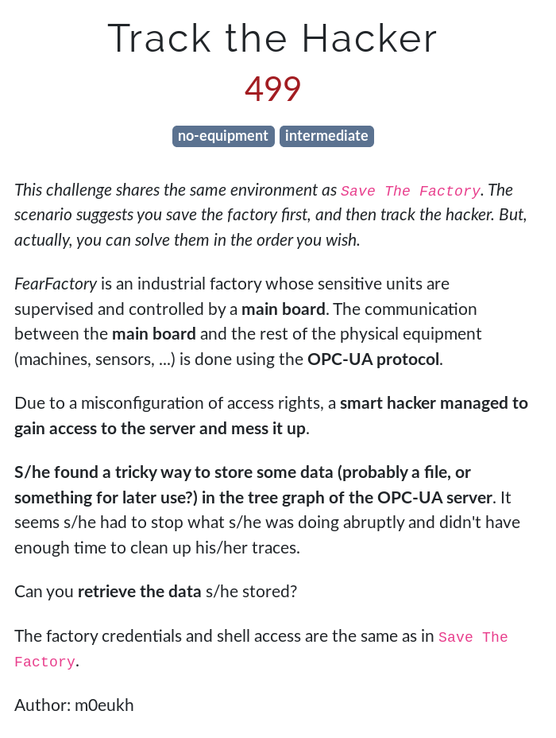

# Track the Hacker:

- Solves: **2**
- Category: Misc
- Estimated difficulty: intermediate
- Author: m0eukh
- Write-up by m0eukh

## Description



## Solution

The hacker has apparently hid some information there. But where could he possibly have put it?

Under the root node, we see some weirdly named nodes (`7PFG6qG+\>qtlx/t`, `BYsqOwY-`, `0J,BICyQu9\>@`, `}HGva\_J;uv99`). It looks fishy, let's see what's inside them.


Let's look at the node names, and their values.


Many numbered nodes with values that look like hexadecimal, also it doesn't look like any node name (number) gets repeated in the four folders/subtrees.

Let's order these node's values according to their names and see what we'll get, could it be a file?:

We will use the following lines of code:
```Python
containers = []
for name in ["7PFG6qG+>qtlx/t", "BYsqOwY-", "0J,BICyQu9\>@", "}HGva_J;uv99"]:
    containers.append(root.get_child(name))

sortedNodes = []
for cont in containers:
    sortedNodes += cont.get_children()
sortedNodes.sort(key=lambda x: int(x.get_browse_name().Name[4:]))

sortedFragments = [frgNode.get_value() for frgNode in sortedNodes]

xFile = open("exfiltratedFile", "a+")
for word in sortedFragments:
    xFile.write(struct.pack(">L", int(word, 16)))
xFile.close()
```

Looks like a zip file:


Flag: `ph0wn{0pc-U4_1s_L1t!}`
