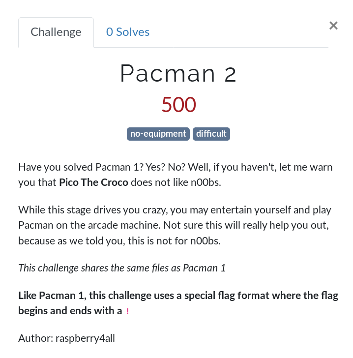

# Pacman 2

- Solves: ** 0 **
- Category: Reverse
- Estimated difficulty: difficult
- Author: Raspberry4All
- Write-up by @cryptax

## Description



The ROM is [here](./puckmanb.zip)

## Solution

This is a MAME ROM. Install MAME `apt-get install mame-tools mame` to play or DAME (Dockerized MAME). The zip of the ROM must be put in the `roms` directory.

- 5 for coins
- 1 to start player 1

This challenge is **Z80 reversing**.

### References

The following documents are very helpful:

- [Z80 Family CPU User Manual](http://z80.info/zip/z80cpu_um.pdf)
- [Z80 Pacman source code](http://www.vecoven.com/elec/pacman/code/pac_z80.html)
- [Pacman Emulation](http://www.lomont.org/Software/Games/PacMan/PacmanEmulation.pdf)
- [RAM map](http://ece545.com/F16/reports/F15_Pacman.pdf) or [here](https://web.archive.org/web/20180205075730/http://www.ece545.com/F16/reports/F15_Pacman.pdf_

### Comparing the ROMs

Download the *real pacman* from [here](https://edgeemu.net/details-20298.htm) and compare with the one from the CTF.

**Unchanged:**

- 82s123.7f
- 82s126.1m: sound ROM
- 82s126.3m: other sound ROM
- 82s126.4a
- namcopac.6e
- namcopac.6h
- pacman.5e
- pacman.5f: sprite ROM (see [here](http://www.lomont.org/Software/Games/PacMan/PacmanEmulation.pdf))

**Changed:**

- namcopac.6f: quite a lot of changes - the size is not changed
- namcopac.6j: quite a lot of changes - the size is not changed

```
$ cmp -l namcopac.6f ../puckmanb/namcopac.6f | gawk '{printf "%08X %02X %02X\n", $1, strtonum(0$2), strtonum(0$3)}' | head 
000009EC 06 C3
000009ED 40 9A
000009EE 70 1F
00000F9B 00 E5
00000F9C 00 D5
00000F9D 00 F5
00000F9E 00 11
00000F9F 00 80
00000FA0 00 FC
00000FA1 00 19

$ cmp -l namcopac.6j ../puckmanb/namcopac.6j | gawk '{printf "%08X %02X %02X\n", $1, strtonum(0$2), strtonum(0$3)}' | head
0000001B 20 3E
0000001C 15 00
00000032 25 B4
00000033 7C 76
00000034 E6 99
00000035 F0 FE
00000CE1 00 01
00000CE2 00 04
00000CE3 00 02
00000CE4 00 05
```

[This document, page 20,](http://www.lomont.org/Software/Games/PacMan/PacmanEmulation.pdf) explains parts of `namcopac.6j`, in particular the ROM checksum. A patched ROM obviously has to patch this too, so let's rather investigate `namcopac.6f` for interesting mods.


### Disassembling namcopac.6f

Use radare2: `r2 -e asm.arch=z80 namcopac.6f`

The first modifications occur at **0x9ec - 0x9ee**.
In this original ROM, this corresponds to loading `0x40` in the RAM:

```
0x000009eb      0640         ld b, 0x40
0x000009ed      70             ld [hl], b    ; load 0x40 in the RAM
```

Let's try and understand a bit more what the routine is doing.

1. Store 0xff at the address of 0x4d9d (game variables RAM - see [page 7](https://web.archive.org/web/20180205075730/http://www.ece545.com/F16/reports/F15_Pacman.pdf))
2. Load the content of `0x4d39` in hl. We'll work out that 0x4d39 is a pointer to the current position of the pacman.
3. If a == 0x10 (this is character `.`), then jump to 0x9e0. We will then increment counter 0x4e0e and put an empty space (character `0x40` is an empty space - see [Figure 4](http://www.lomont.org/Software/Games/PacMan/PacmanEmulation.pdf)  at 0x4d39
4. If a == 0x14 (this is the big dot character), then return


```
0x000009cd      3eff           ld a, 0xff
0x000009cf      329d4d         ld [0x4d9d], a
0x000009d2      2a394d         ld hl, [0x4d39]
0x000009d5      cd6500         call 0x0065
0x000009d8      7e             ld a, [hl]
0x000009d9      fe10           cp 0x10
0x000009db      2803           jr z, 0x03
0x000009dd      fe14           cp 0x14
0x000009df      c0             ret nz
0x000009e0      dd210e4e       ld ix, 0x4e0e
0x000009e4      dd3400         inc [ix+0x00]
0x000009e7      e60f           and 0x0f
0x000009e9      cb3f           srl a
0x000009eb      0640           ld b, 0x40
0x000009ed      70             ld [hl], b
```

Now, let's compare with what we have in the patched ROM. We see `c3 9a 1f`, which corresponds to a jump to `0x1f9a`. 

```
0x000009eb      c39a1f         jp 0x1f9a
```

namcopac.6f is loaded at addresses `0x1000-0x1ffff`, so when we see a jump to 0x1f9a, this corresponds to a jump to `0xf9a` in our disassembled file. And, bingo, we have lots of changes in the ROM starting at this address!

So, basically, the patched ROM jumps to the **patch**.

### Reversing the patch (0xf9a - ...)

We disassemble after 0xf9a.

1. The location of the pacman is in `hl`
2. The pacman level is at address `0x4e13` (we know it is some kind of game parameter, and guess it is the level after a while)
3. Test if character needs decoding doing: `((current address + 0xfc80) ^ level) & 0x07`
4. If this test is equal to 0, we will decode: `((current address + 0xfc80) >> 3) + 0x40`


```
[0x000009ea]> s 0xf9a
[0x00000f9a]> pd 30
           0x00000f9a      e5             push hl                     ; push hl on the stack. hl stores the location of the pacman
            0x00000f9b      d5             push de                   ; push de on the stack.
            0x00000f9c      f5             push af                     ; push af on the stack
            0x00000f9d      1180fc         ld de, 0xfc80         
            0x00000fa0      19             add hl, de                 ; move hl to current pos + 0xfc80
            0x00000fa1      3a134e         ld a, [0x4e13]       ; load content of 0x4e13 (pacman level) in a
            0x00000fa4      5f             ld e, a                       ; for first level, a will be 0, so will e be 0
            0x00000fa5      1600           ld d, 0x00
            0x00000fa7      19             add hl, de
            0x00000fa8      7d             ld a, l
            0x00000fa9      d6e0         sub 0xe0                ; substract 0x3fe0
            0x00000fab      7c             ld a, h
            0x00000fac      de3f           sbc a, 0x3f
        ,=< 0x00000fae      3011           jr nc, 0x11         ; check we are not beyond limits
        |   0x00000fb0      7e             ld a, [hl]                  ; load value at current position in a
        |   0x00000fb1      ab             xor e                       ; do xor with e (=level)
        |   0x00000fb2      e607         and 0x07                 ; do & 0x07
       ,==< 0x00000fb4      200b           jr nz, 0x0b        ; jump if not equal to 0. Jumps to 0xfb6+0x0b=0xfc1
       ||   0x00000fb6      7e             ld a, [hl]        
       ||   0x00000fb7      cb3f           srl a
       ||   0x00000fb9      cb3f           srl a
       ||   0x00000fbb      cb3f           srl a                       ; divide by 8
       ||   0x00000fbd      c640           add a, 0x40                 ; we write letters only in the patch and they are between 0x41 and 0x5a
       ||   0x00000fbf      47             ld b, a                     ; b=a=character to write
       ||   0x00000fc0      210640         ld hl, 0x4006       ; beware we actually jump in 0xfc1 from 0xfb4
            0x00000fc3      f1             pop af
            0x00000fc4      d1             pop de
            0x00000fc5      e1             pop hl
            0x00000fc6      70             ld [hl], b                  ; write character at position
        ,=< 0x00000fc7      c3ee19         jp 0x19ee         ; jump back to 0x9ee (end of patch)
```

If this test is not equal to 0, we jump to `0xfc1`. Beware, this jumps in the middle of an instruction. We will actually replace the current character of the current position of the pacman by a space (0x40) and pop.

```
[0x00000fc1]> pd 3
            0x00000fc1      0640           ld b, 0x40
            0x00000fc3      f1             pop af
            0x00000fc4      d1             pop de
```

### Implementing a solution

[The addresses of the pacman screen are shown at Figure 8, page 11](http://www.lomont.org/Software/Games/PacMan/PacmanEmulation.pdf). The lines where the Pacman goes are basically between 0x3a1 and 0x3bf. As this is in the Video RAM, this corresponds to addresses 0x43a1 to 0x43bf.

Then, to parse a line left to right, note the addresses go down by 0x20. So, 0x43a1, then 0x4380... 0x4041.

Then, we code the check. Note that:

- `+0xfc80` is equal to `-0x380`.
- The values we read are within the range 0x1000, whereas the video RAM is in the 0x4000. So, we have to map by removing `0x3000`.
- First level is level `0`
- I started by decoding only the 2 lines where messages seemed to appear. Then, I realized I should print the entire screen as the flag was spawning on multiple lines.

```python
#!/usr/bin/env python

def decode(buffer, position=0x42b8,level=0x00):
    pacman_tile = ' ABCDEFGHIJKLMNOPQRSTUVWXYZ!'
    character_address = position+level-0x380 - 0x3000
    #print("Reading at 0x%0x..." % character_address)

    try:
        if ((ord(buffer[character_address]) ^ level) & 0x07) != 0:
            return ' '

        decoded = ord(buffer[character_address]) >> 3
        assert decoded < len(pacman_tile), "Beyond letters: decoded=0x%02x position=0x%02x level=%d" % (decoded, position, level)
        return pacman_tile[decoded]
    except:
        return ' '

def read_msg(buffer, addresses, level):
    msg = ''
    for video_address in addresses:
        msg = msg +  decode(b, position=video_address,level=level)
    return msg

def read_lower_msg(buffer, level=0):
    return read_msg(buffer, addresses=range(0x42f8, 0x4118, -0x20), level=level)

def read_upper_msg(buffer, level=0):
    return read_msg(buffer, addresses=range(0x4306, 0x40a6, -0x20), level=level)

def print_entire_screen(buffer, level=0):
    print('-'*0x1b)
    for lines in range(0x43a1,0x43bf):
        addresses=range(lines, lines-0x360, -0x20)
        #    print '0x%02X - 0x%02X' % (lines, lines-0x360)
        print(read_msg(buffer, addresses, level=level))
    print('-'*0x1b)

if __name__ == '__main__':
    b = open('../puckman/namcopac.6j','rb').read()

    for level in range(0,8):
        print("Level %d -----------" % (level+1))
        print(read_upper_msg(b,level=level))
        print(read_lower_msg(b,level=level))

    print("Screen of Level 5 ----------------")
    print_entire_screen(b, level=4)

    print("Screen of Level 8 ---------------")
    print_entire_screen(b, level=7)
```

Output:

```
Level 1 -----------
  GET READY FOR    
  PHOWN   CTF  
Level 2 -----------
ARE YOU LOOKING FOR
 PHOWN    FLAGS
Level 3 -----------
   GREETINGS TO    
AXELLE    LUDO 
Level 4 -----------
   HUSH HUSH MR    
  PAC      MAN 
Level 5 -----------
   A FIRST FLAG    
 GIVEN   BY PIC
Level 6 -----------
  PHOWN FLAG IS    
  NEXT    LEVEL
Level 7 -----------
 NO PICO MESSED UP 
 NEXT     LEVEL
Level 8 -----------
    ISINAWARPT     
 PHOWN    FLAG 
Screen of Level 5 ----------------
---------------------------
                           
                           
                           
                           
                           
        A FIRST FLAG       
                           
                           
                           
                           
                           
                           
                           
                           
                           
                           
                           
                           
                           
                           
                           
                           
                           
       GIVEN   BY PICO     
                           
                           
  A                    !TAE
                          R
                          G
                   !PICOTHE
---------------------------
Screen of Level 8 ---------------
---------------------------
                           
                           
                           
                           
                           
         ISINAWARPT        
         O        U        
         C        N        
         IP!   !LEN        
                           
                           
                           
                           
                           
                           
                           
                           
                           
                           
                           
  H                        
                           
                           
       PHOWN    FLAG       
                           
                           
          AT   LAST        
                           
                           
                           
---------------------------
```

We get the flag for Pacman 1 at Level 5: `!PICOTHEGREAT!` and the flag for Pacman 2 at Level 8 `!PICOISINAWARPTUNNEL!`

Thanks to **Raspberry4All**, who was very patient with my debugging and questions.

- Pacman 1 could be solved by playing the game until Level 5. No computer skills ;) (but good pacman skills ;P)
- Pacman 2 could **not** be solved by playing: a bug in the patch had been introduced on purpose to ensure level 8 would not display.

